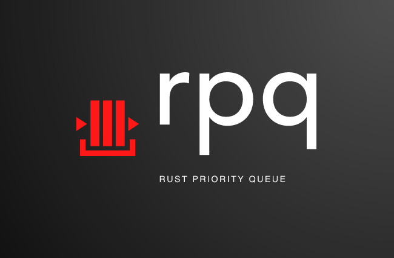
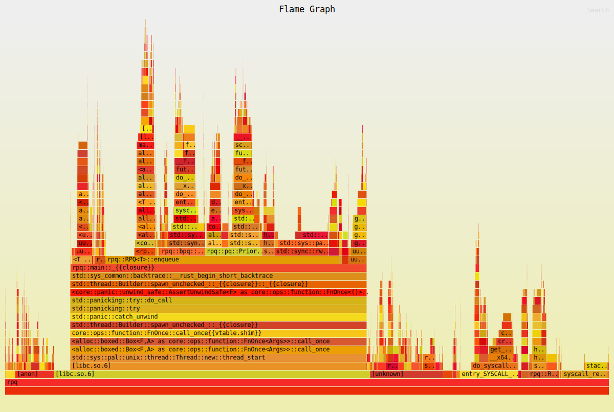

  

<h4 align="center">
  RPQ is a my first Rust project is very experimental at this stage. It will be sometime before this project is in a stable place. 
</h4>

## Table of Contents
1. [Table of Contents](https://github.com/JustinTimperio/rpq?tab=readme-ov-file#table-of-contents)
2. [Background](https://github.com/JustinTimperio/rpq?tab=readme-ov-file#background)
4. [Benchmarks](https://github.com/JustinTimperio/rpq?tab=readme-ov-file#benchmarks)
3. [Usage](https://github.com/JustinTimperio/rpq?tab=readme-ov-file#usage)
5. [Contributing](https://github.com/JustinTimperio/rpq?tab=readme-ov-file#contributing)
6. [License](https://github.com/JustinTimperio/rpq?tab=readme-ov-file#license)

## Background

#### Other Priority Queues I'm Working On
- [fibheap (Fibonacci Heaps)](https://github.com/JustinTimperio/fibheap)
- [gpq (Go Priority Queue)](https://github.com/JustinTimperio/gpq)
- [rpq (Rust Priority Queue)](https://github.com/JustinTimperio/rpq)

## Benchmarks

## Usage

### Prerequisites 

### Import Directly

### API Reference

#### Example Usage

## Contributing
RPQ is actively looking for maintainers so feel free to help out when:

- Reporting a bug
- Discussing the current state of the code
- Submitting a fix
- Proposing new features

### We Develop with Github
We use github to host code, to track issues and feature requests, as well as accept pull requests.

### All Code Changes Happen Through Pull Requests
1. Fork the repo and create your branch from `master`.
2. If you've added code that should be tested, add tests.
3. If you've changed APIs, update the documentation.
4. Ensure the test suite passes.
5. Make sure your code lints.
6. Issue that pull request!

### Any contributions you make will be under the MIT Software License
In short, when you submit code changes, your submissions are understood to be under the same [MIT License](http://choosealicense.com/licenses/mit/) that covers the project. Feel free to contact the maintainers if that's a concern.

### Report bugs using Github's [Issues](https://github.com/JustinTimperio/rpq/issues)
We use GitHub issues to track public bugs. Report a bug by opening a new issue; it's that easy!

### Write bug reports with detail, background, and sample code
**Great Bug Reports** tend to have:

- A quick summary and/or background
- Steps to reproduce
  - Be specific!
  - Give sample code if you can.
- What you expected would happen
- What actually happens
- Notes (possibly including why you think this might be happening, or stuff you tried that didn't work)

## License
All code here was originally written by me, Justin Timperio, under an MIT license with the exception of some code directly forked under a BSD license from the Go maintainers.