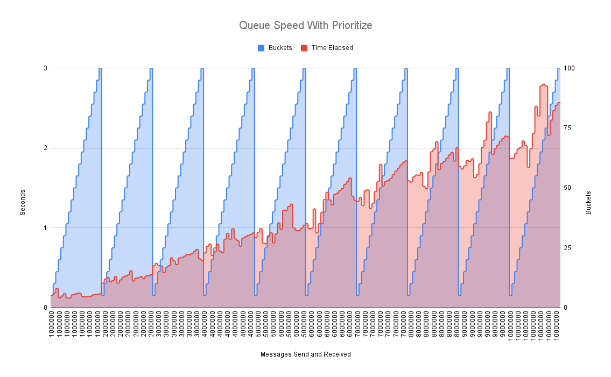
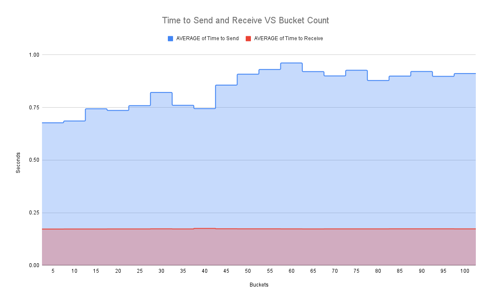

<p align="center">
  
</p>

<h4 align="center">
   RPQ is an extremely fast and flexible priority queue, capable of millions of transactions a second. RPQ supports a complex "Double Priority Queue" which allows for priorities to be distributed across N buckets, with each bucket holding a second priority queue which allows for internal escalation and timeouts of items based on parameters the user can specify during submission combined with how frequently you ask RPQ to prioritize the queue. 
</h4>


- [Background](#background)
  - [Should I Use RPQ?](#should-i-use-rpq)
  - [Sister Projects](#sister-projects)
- [Benchmarks](#benchmarks)
- [Usage](#usage)
  - [API Reference](#api-reference)
    - [Example Usage](#example-usage)
- [Contributing](#contributing)
  - [We Develop with Github](#we-develop-with-github)
  - [All Code Changes Happen Through Pull Requests](#all-code-changes-happen-through-pull-requests)
  - [Any contributions you make will be under the MIT Software License](#any-contributions-you-make-will-be-under-the-mit-software-license)
  - [Report bugs using Github's Issues](#report-bugs-using-githubs-issues)
  - [Write bug reports with detail, background, and sample code](#write-bug-reports-with-detail-background-and-sample-code)
- [License](#license)


## Background
RPQ was written as an experiment when I was playing with [Fibonacci Heaps](https://en.wikipedia.org/wiki/Fibonacci_heap) and wanted to find something faster. I was disappointed by the state of research and libraries being used by most common applications, so RPQ is meant to be a highly flexible framework that can support a multitude of workloads.

### Should I Use RPQ?
RPQ is a concurrency safe, embeddable priority queue that can be used in a variety of applications. RPQ might be the right choice if:
- Your data requires strict ordering guarantees
- You need to prioritize items that are in the queue too long 
- You need to timeout items
- You have multiple writers and readers that need to access the queue concurrently
- You run critical workloads and need to store the queue on disk in case of a crash

### Sister Projects 
- [fibheap (Fibonacci Heaps)](https://github.com/JustinTimperio/fibheap)
- [gpq (Go Priority Queue)](https://github.com/JustinTimperio/gpq)
- [pq-bench (Priority Queue Benchmarks)](https://github.com/JustinTimperio/pq-bench)

## Benchmarks
Due to the fact that most operations are done in constant time O(1) or logarithmic time O(log n), with the exception of the prioritize function which happens in linear time O(n), all RPQ operations are extremely fast. A single RPQ can handle a few million transactions a second and can be tuned depending on your work load. I have included some basic benchmarks using C++, Rust, Zig, and Go to measure RPQ's performance against the standard implementations of other languages that can be found here at: [pq-bench](https://github.com/JustinTimperio/pq-bench). 

|                                                                                                             |                                                                                                 |
|-------------------------------------------------------------------------------------------------------------|-------------------------------------------------------------------------------------------------|
|  |                   |
|                               |  |

## Usage
RPQ is a embeddable priority queue that is meant to be used at the core of critical workloads where complex ordering are required in combination with large volumes of data. The best way to us RPQ is to import the Crate and use the API to interact with the queue.

TODO: Publish to crates.io

```toml
[dependencies]
rpq = "0.1.3"
```

### API Reference
- `RPQ::new(options: RPQOptions) -> Result<(RPQ, usize), Error>` - Creates a new RPQ with the given options and returns the number of restored items.
  - `enqueue(mut item: Item) -> Result<(), Error>` - Enqueues a new item into the RPQ.
  - `dequeue() -> Result<Item, Error>` - Dequeues the next item from the RPQ.
  - `prioritize() -> Result<(usize, usize), Error>` - Prioritizes the items in the RPQ and returns the number of timed out and reprioritized items.
  - `len() -> usize` - Returns the number of items in the RPQ.
  - `active_buckets() -> usize` - Returns the number of active buckets in the RPQ.
  - `unsynced_batches() -> usize` - Returns the number of unsynced batches pending to be commit to disk.
  - `items_in_db() -> usize` - Returns the number of items in the RPQ database.
  - `close()` - Closes the RPQ and saves the state to disk if needed.


#### Example Usage
```rust
use std::sync::Arc;
use std::time::{Duration, Instant};
use rpq::pq::Item;
use rpq::{RPQOptions, RPQ};

#[tokio::main(flavor = "multi_thread")]
async fn main() {
    let message_count = 10_000_000;

    let options = RPQOptions {
        bucket_count: 10,
        disk_cache_enabled: false,
        database_path: "/tmp/rpq.redb".to_string(),
        lazy_disk_cache: false,
        lazy_disk_max_delay: Duration::from_secs(5),
        lazy_disk_cache_batch_size: 5000,
        buffer_size: 1_000_000,
    };

    let r = RPQ::new(options).await;
    match r {
        Ok(_) => {}
        Err(e) => {
            println!("Error Creating RPQ: {}", e);
            return;
        }
    }

    let (rpq, _) = r.unwrap();

    let timer = Instant::now();
    let send_timer = Instant::now();
    for i in 0..message_count {
        let item = Item::new(
            i % 10,
            i,
            false,
            None,
            false,
            Some(Duration::from_secs(5)),
        );
        let result = rpq.enqueue(item).await;
        if result.is_err() {
            println!("Error Enqueuing: {}", result.err().unwrap());
            return;
        }
    }

    let send_elapsed = send_timer.elapsed().as_secs_f64();

    let receive_timer = Instant::now();
    for _i in 0..message_count {
        let result = rpq.dequeue().await;
        if result.is_err() {
            println!("Error Dequeuing: {}", result.err().unwrap());
            return;
        }
    }

    let receive_elapsed = receive_timer.elapsed().as_secs_f64();

    println!(
        "Time to insert {} messages: {}s",
        message_count, send_elapsed
    );
    println!(
        "Time to receive {} messages: {}s",
        message_count, receive_elapsed
    );
    println!("Total Time: {}s", timer.elapsed().as_secs_f64());
}
```

## Contributing
RPQ is actively looking for maintainers so feel free to help out when:

- Reporting a bug
- Discussing the current state of the code
- Submitting a fix
- Proposing new features

### We Develop with Github
We use github to host code, to track issues and feature requests, as well as accept pull requests.

### All Code Changes Happen Through Pull Requests
1. Fork the repo and create your branch from `master`.
2. If you've added code that should be tested, add tests.
3. If you've changed APIs, update the documentation.
4. Ensure the test suite passes.
5. Make sure your code lints.
6. Issue that pull request!

### Any contributions you make will be under the MIT Software License
In short, when you submit code changes, your submissions are understood to be under the same [MIT License](http://choosealicense.com/licenses/mit/) that covers the project. Feel free to contact the maintainers if that's a concern.

### Report bugs using Github's [Issues](https://github.com/JustinTimperio/rpq/issues)
We use GitHub issues to track public bugs. Report a bug by opening a new issue; it's that easy!

### Write bug reports with detail, background, and sample code
**Great Bug Reports** tend to have:

- A quick summary and/or background
- Steps to reproduce
  - Be specific!
  - Give sample code if you can.
- What you expected would happen
- What actually happens
- Notes (possibly including why you think this might be happening, or stuff you tried that didn't work)


## License
All code here was originally written by me, Justin Timperio, under an MIT license.